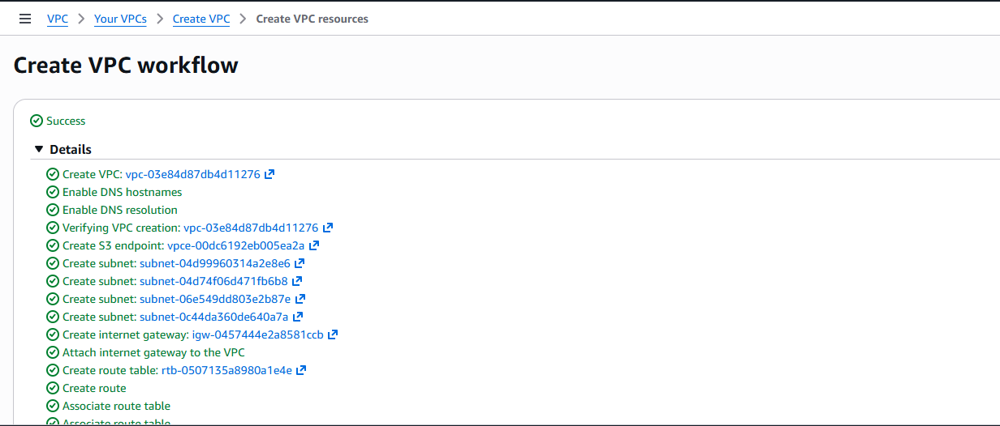
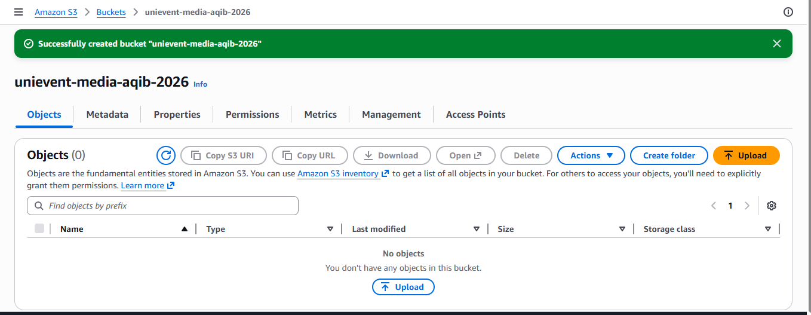
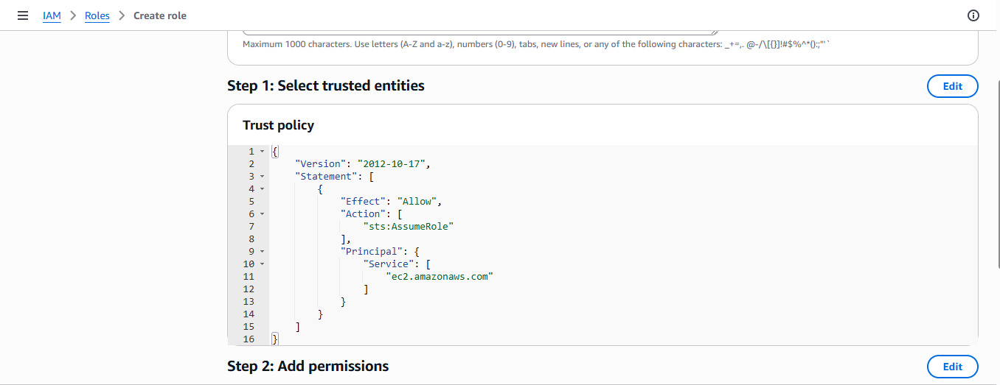
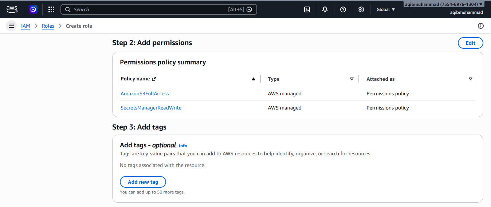
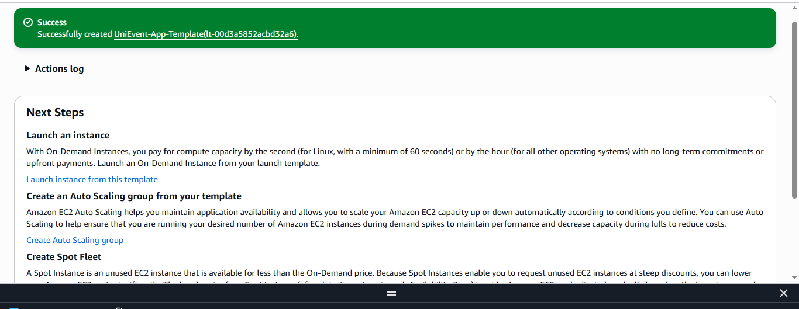
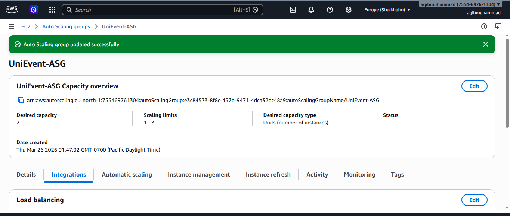
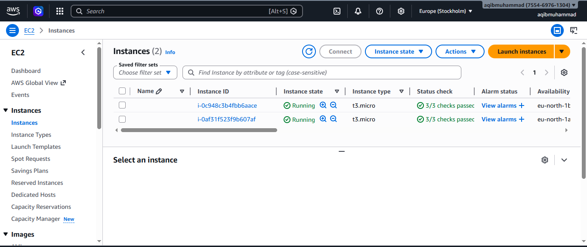
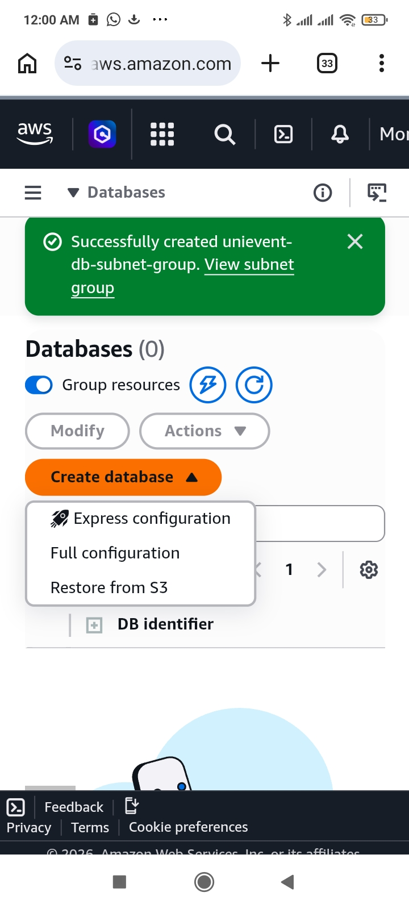
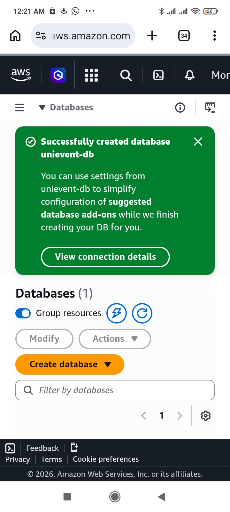
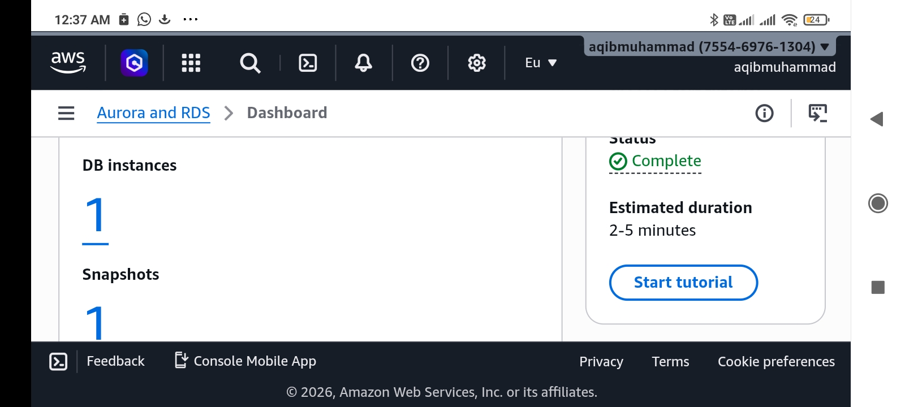

# Assignment1_AWS_CE
# UniEvent: Scalable University Event Management System

## Phase 1: API Selection & Logic
As a Cloud Architect, I have chosen to integrate the **Ticketmaster Discovery API** for this project.

### API Justification
* **Data Structure**: It provides structured JSON including title, date, venue, and image URLs.
* **Automation**: It allows the system to fetch real-time event data automatically rather than using manual entry.

### Local Verification
I verified the API functionality using a Python script (`fetch_events.py`) which successfully retrieves event details.
## Phase 2: Network Infrastructure (VPC)
As the Cloud Architect, I designed a custom VPC to host the UniEvent platform securely and reliably.

### Architectural Design
* **Multi-AZ Deployment**: The network is spread across two Availability Zones (AZs) to ensure the system is fault-tolerant and remains available even if one data center fails.
* **Public Subnets**: Two public subnets were created to house the Application Load Balancer and NAT Gateways.
* **Private Subnets**: Following security best practices, the web application runs on multiple EC2 instances inside private subnets, protecting them from direct internet access.
* **Connectivity**: A Regional NAT Gateway was configured so the private instances can securely fetch data from the Ticketmaster API.
* **S3 Gateway Endpoint**: I implemented an S3 Gateway endpoint to allow private, secure media uploads to S3 without traversing the public internet.

### VPC Resource Map

## Phase 3: Secure Storage (S3)
I have configured an Amazon S3 bucket to securely store university event posters and media.

### Security Implementation
* **Bucket Privacy**: "Block all public access" is enabled to ensure event data remains private.
* **Access Control**: ACLs are disabled to enforce modern, policy-based access management.
* **Storage Logic**: The bucket is prepared to receive image uploads from the private EC2 instances via the S3 Gateway Endpoint.

## Phase 4: Identity & Access Management (IAM)
I implemented an IAM Role to provide the EC2 instances with secure access to AWS services without hardcoding credentials.

### Security Configuration
* **Trust Policy**: Configured to allow only the `ec2.amazonaws.com` service to assume this role.
* **Permissions**: Attached `AmazonS3FullAccess` for event media storage and `SecretsManagerReadWrite` for secure API key management.

## Phase 5: High Availability & Load Balancing
In this phase, I implemented the compute layer of the UniEvent platform. The goal was to ensure the application is highly available and can handle fluctuating student traffic during event registrations.

### 1. Standardized Deployment (Launch Template)
I created an EC2 Launch Template to serve as a consistent blueprint for all application servers. 
* **AMI**: Amazon Linux 2023 (Free Tier Optimized).
* **Instance Type**: t3.micro.
* **Security & Permissions**: Attached the `UniEvent-S3-Role` for secure access to event posters in S3 and assigned a custom Security Group to restrict traffic to HTTP (Port 80) and SSH (Port 22).

### 2. Traffic Distribution (Application Load Balancer)
An **Application Load Balancer (ALB)** was deployed in the public subnets. This acts as the "front door" for the application, receiving internet traffic and distributing it to the backend instances.
* **Scheme**: Internet-facing.
* **Health Checks**: Configured to monitor instance health; if a server stops responding, the ALB automatically stops sending traffic to it.

### 3. Elasticity and Self-Healing (Auto Scaling)
I configured an **Auto Scaling Group (ASG)** to manage the server cluster across two Availability Zones (**eu-north-1a** and **eu-north-1b**).
* **Capacity Settings**: 
    - Desired: 2 (To ensure fault tolerance).
    - Minimum: 1 (Baseline availability).
    - Maximum: 3 (Scalability for peak demand).
* **Self-Healing**: If an instance fails, the ASG automatically launches a replacement to maintain the desired capacity of 2.

### 4. Verification of Live Infrastructure
The following image confirms that the Auto Scaling Group has successfully provisioned two healthy instances across different availability zones, fulfilling the high-availability requirement.

## Phase 6: Relational Database Service (RDS) Integration

In this phase, I implemented the data persistence layer for the UniEvent platform. To ensure high security and reliability, I deployed a managed MySQL database within the private subnets of the UniEvent-VPC.

### 1. Database Subnet Group Configuration
To ensure the database is highly available and isolated, I created a custom DB Subnet Group. This group restricts the database to the private subnets in two Availability Zones (eu-north-1a and eu-north-1b), ensuring it has no direct route to the public internet.

### 2. Database Instance Details
I provisioned a MySQL 8.0 instance using the AWS Free Tier to manage event metadata efficiently.
* **DB Identifier**: `unievent-db`
* **Engine**: MySQL Community (8.0.x)
* **Instance Class**: db.t3.micro (Free Tier)
* **Storage**: 20GB General Purpose SSD (gp3)

### 3. Security and Connectivity
The database follows the **"Principle of Least Privilege"**:
* **Public Access**: Disabled (Set to 'No').
* **VPC Security Group**: Assigned `UniEvent-App-SG`, which is configured to only allow inbound traffic on **Port 3306** from the application server tier.
* **Multi-AZ**: Disabled for Free Tier compliance, but the architecture is ready for Multi-AZ failover in a production environment.

### 4. Final Deployment Status
The database was successfully provisioned and is currently in the **Available** state, ready to receive connections from the Python backend worker.

